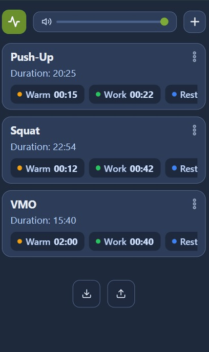
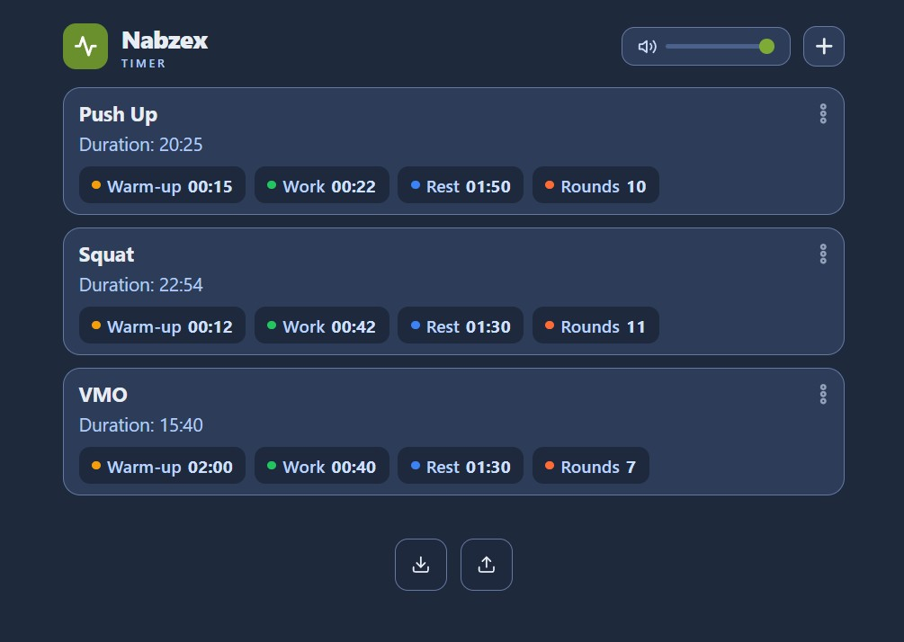

# Nabzex - Offline Workout & Interval Timer

Nabzex is a fast, lightweight, and offline-first web-based interval timer designed for workout routines, HIIT sessions, Tabata training, and round/rep tracking. Built as a standalone HTML5 application without heavy external dependencies.

Live Demo:

English: [ https://<kullanici-adi>.github.io/Nabzex-Workout-Timer/en/](https://orayemre.github.io/Nabzex-Workout-Timer/en/)

Turkish: [ https://<kullanici-adi>.github.io/Nabzex-Workout-Timer/](https://orayemre.github.io/Nabzex-Workout-Timer/)

## Mobile: 

## Desktop: 

## Key Features

- Custom Preset Management: Create, edit, duplicate, and reorder workout presets. 
- Round & Rep Tracking: Set unique target repetitions for every round.
- Web Audio API Sound Alerts: Synthesized sound prompts without external audio assets.
- Screen Wake Lock API: Keeps the device screen awake during workouts.
- Data Portability: Export and import preset profiles via JSON backup files.
- Mobile-First & Responsive: Smooth layout optimized for mobile viewports and touch interaction.

## Tech Stack

- HTML5 / CSS3 (Custom CSS Variables, CSS Grid/Flexbox)
- Pure JavaScript
- HTML5 LocalStorage API

## Getting Started

1. Clone or download the repository.
2. Open `index.html` in any web browser.
3. No build tools or package managers required.

## License

Distributed under the MIT License.
